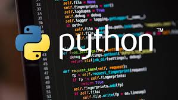

# Python for Beginners 🐍

[](https://www.python.org/downloads/)
[](https://opensource.org/licenses/MIT)
[](https://github.com/Yrashka2025/python-for-beginners)
[](https://github.com/Yrashka2025/python-for-beginners)



Welcome to **Python for Beginners**! This repository contains comprehensive learning materials and practical examples to help you master Python programming from the ground up.


# This project was created by **[Yrashka2025](https://github.com/Yrashka2025)**.

##  Getting Started

This course is designed for complete beginners who want to learn Python programming step by step. Each module builds upon the previous one, providing a solid foundation in Python programming.

### Quick Start
1. Make sure you have Python installed on your system
2. Clone this repository
3. Start with the "Hello World" section
4. Follow the modules in order

##  Structure

```
Python for beginners/
├── Hello World/       # Your first Python program
├── Types/            # Data types and variables
├── Maths operators/  # Mathematical operations
├── Operators/        # Comparison and logical operators
├── Input/           # User input handling
├── cycles/          # Loops (for, while, break, continue)
├── Lists/           # Python list data structure
├── Tuples/          # Immutable sequences
├── Dictionaries/    # Key-value pair collections
└── Images/          # Course illustrations
```


###  Basic Fundamentals
- **[Hello World](Hello%20World/hello.py)** - Your first Python program
- **[Data Types](Types/types.py)** - Understanding Python's type system
- **[Math Operations](Maths%20operators/)** - Basic arithmetic and calculations
- **[Operators](Operators/operators.py)** - Comparison, logical, and assignment operators

###  Input & Output
- **[User Input](Input/input.py)** - Handling user interaction

###  Control Flow
- **[Loops](cycles/)**
  - [For Loops](cycles/for.py)
  - [While Loops](cycles/while.py)
  - [Break & Continue](cycles/break.py)
  - [Range Function](cycles/range.py)
  - [Break and Continue Combined](cycles/break%20and%20continue.py)

###  Data Structures
- **[Lists](Lists/list.py)** - Mutable ordered collections
- **[Tuples](Tuples/typle.py)** - Immutable ordered collections
- **[Dictionaries](Dictionaries/Dictionar.py)** - Key-value pair mappings

##  How to Use This Repository

### For Each Module:
1.  **Read** the comments in the code files
2.  **Run** the examples to see them in action
3.  **Modify** the code to experiment
4.  **Understand** each concept before moving to the next


##  Prerequisites

- Python 3.x installed on your system
- IDE (like VS Code)
- Basic computer literacy


##  Support the Project 

If you find this project helpful, please give it a ⭐ star on GitHub! Your support motivates me to create more awesome tutorials.


**Happy Coding! 🎉**

*Remember: Every expert was once a beginner. Keep practicing and enjoy the journey!*

